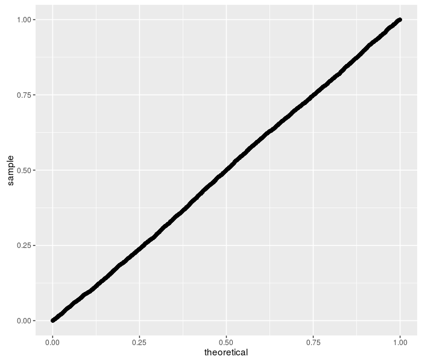
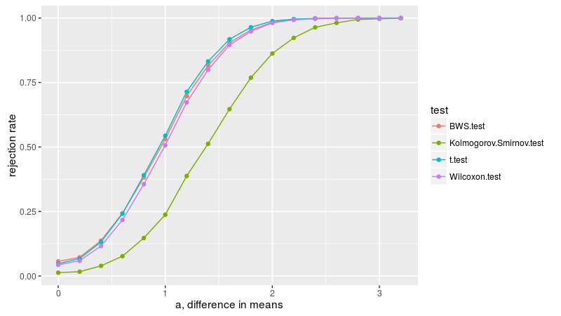
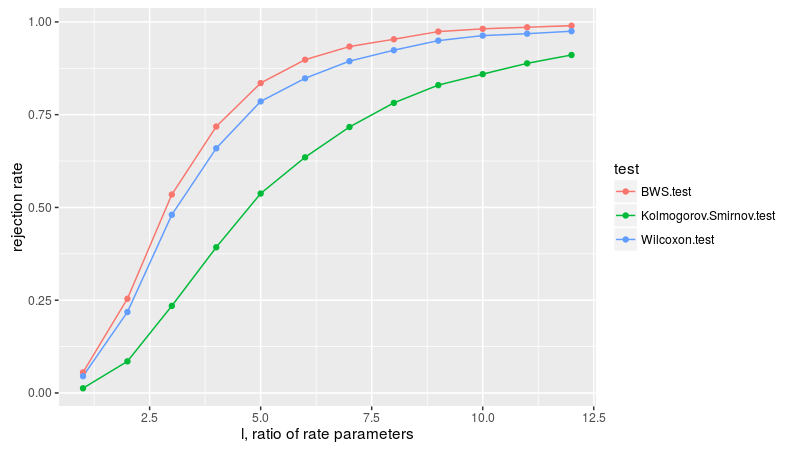
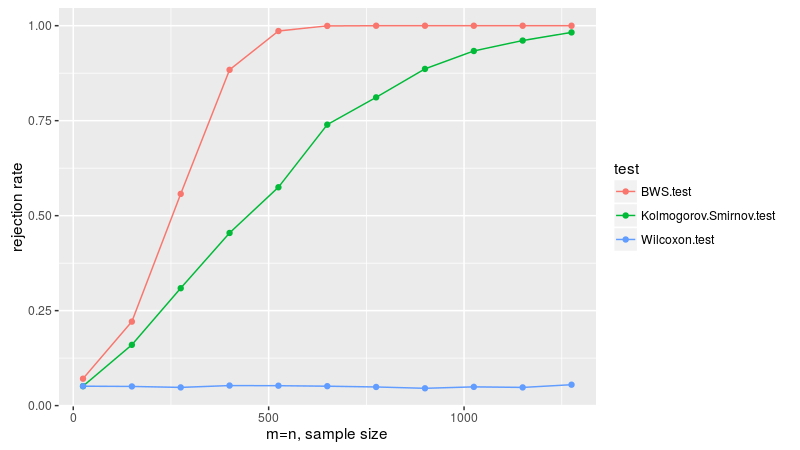

# BWStest

[](https://travis-ci.org/shabbychef/BWStest)
[](http://codecov.io/github/shabbychef/BWStest?branch=master)
[](http://cran.rstudio.com/package=BWStest) 
[](http://www.r-pkg.org/pkg/BWStest)
[](http://www.r-pkg.org/pkg/BWStest)


Performs the [Baumgartner-Weiß-Schindler 2-sample test](http://doai.io/10.2307/2533862) of equal probability
distributions. 

-- Steven E. Pav, shabbychef@gmail.com

## Installation

This package can be installed 
from CRAN, 
via [drat](https://github.com/eddelbuettel/drat "drat"), or
from github:


```r
# via CRAN:
install.packages("BWStest")
# via drat:
if (require(drat)) {
    drat:::add("shabbychef")
    install.packages("BWStest")
}
# get snapshot from github (may be buggy)
if (require(devtools)) {
    install_github("shabbychef/BWStest")
}
```

# Basic Usage

The front end for the hypothesis test is the function `bws_test`. At the moment, this only
supports the classical Baumgartner-Weiß-Schindler test, returning a `htest` object:


```r
require(BWStest)
set.seed(12345)
# under the null:
x <- rnorm(200)
y <- rnorm(200)
bval <- bws_test(x, y)
show(bval)
```

```
## 
## 	two-sample BWS test
## 
## data:  x vs. y
## b = 1, p-value = 0.2
## alternative hypothesis: two.sided
```

```r
# under the alternative:
z <- rnorm(200, mean = 1)
bval <- bws_test(x, z)
show(bval)
```

```
## 
## 	two-sample BWS test
## 
## data:  x vs. z
## b = 30, p-value <2e-16
## alternative hypothesis: two.sided
```

## Checking the null

  _Doverai No Proverai_ (Trust, but verify.) -- Russian proverb.

Here we perform 5000 simulations of the BWS test under the null hypothesis, then
compute the CDF of the test statistic. If the code is correct, the resultant p-values
should be uniform. So I q-q plot under the uniform law:


```r
require(BWStest)

# now compute a bunch under the null:
set.seed(1234)
bvals <- replicate(5000, bws_stat(rnorm(100), rnorm(100)))
# compute the approximate p-values under the null:
pvals <- bws_cdf(bvals)

require(ggplot2)
ph <- ggplot(data.frame(pv = pvals), aes(sample = pv)) + 
    stat_qq(distribution = stats::qunif)
print(ph)
```



Looks good to me!

## Under the alternative

Here we replicate figure 2A of Baumgartner _et al._ We draw two samples from the normal distribution,
both with unit standard deviation, letting _a_ be the difference in means. 
We check the empirical rejection rate at the 0.05 level for a few different tests.
As in Baumgartner, we find that the lowly t-test
is the most powerful in this case, with the BWS, Cramer-Von Mises, and Wilcoxon tests displaying similar power, 
then the KS test the least powerful. Note that the Kolmogorov Smirnov test does not appear to have nominal
coverage under the null, probably due to the small sample size.


```r
n.sim <- 10000
avals <- seq(0, 3.2, length.out = 17)
alpha <- 0.05
mnsize <- 10

# this is archived on CRAN, unfortunately:
library(CvM2SL2Test)
# find the CVM critical value.
critv <- uniroot(function(x) {
    cvmts.pval(x, mnsize, mnsize) - alpha
}, lower = 0, upper = 100, maxiter = 5000)$root

set.seed(1234)
simul <- sapply(avals, function(a) {
    rejs <- replicate(n.sim, {
        x <- rnorm(mnsize, mean = 0)
        y <- rnorm(mnsize, mean = a)
        bws <- bws_cdf(bws_stat(x, y), lower_tail = FALSE) <= 
            alpha
        ttv <- t.test(x, y, alternative = "two.sided")$p.value <= 
            alpha
        cvm <- cvmts.test(x, y) >= critv
        ksv <- ks.test(x, y, alternative = "two.sided")$p.value <= 
            alpha
        wcx <- wilcox.test(x, y, alternative = "two.sided")$p.value <= 
            alpha
        c(bws, ttv, cvm, ksv, wcx)
    })
    rejrate <- rowMeans(rejs)
    names(rejrate) <- c("BWS test", "t test", "Cramer-Von Mises test", 
        "Kolmogorov Smirnov test", "Wilcoxon test")
    rejrate
}, simplify = "matrix")

Arejrates <- data.frame(t(simul))
Arejrates$a <- avals
```

```r
library(tidyr)
library(dplyr)
library(ggplot2)
plotdf <- tidyr::gather(Arejrates, "test", "rejection_rate", 
    -a) %>% dplyr::mutate(test = gsub("\\.", " ", test))
ph <- ggplot(plotdf, aes(x = a, y = rejection_rate, 
    group = test, colour = test)) + geom_line() + geom_point() + 
    labs(x = "a, difference in means", y = "rejection rate")
print(ph)
```



Here we replicate figure 2B of Baumgartner _et al._ We draw two samples from the normal distribution,
both with zero mean, one with unit standard deviation, the other with standard deviation of _sigma_.
We compute the empirical rejection rate at the 0.05 level, dropping the t-test
since it is not relevant for this formulation.
As in Baumgartner, 
we find the BWS test is the most powerful, followed by KS test, then Cramer-Von Mises, 
then Wilcoxon, which is basically useless in this simulation.


```r
n.sim <- 10000
svals <- seq(1, 45, length.out = 10)
alpha <- 0.05
mnsize <- 10

# this is archived on CRAN, unfortunately:
library(CvM2SL2Test)
# find the CVM critical value.
critv <- uniroot(function(x) {
    cvmts.pval(x, mnsize, mnsize) - alpha
}, lower = 0, upper = 100, maxiter = 5000)$root

set.seed(1234)
simul <- sapply(svals, function(s) {
    rejs <- replicate(n.sim, {
        x <- rnorm(mnsize, mean = 0, sd = 1)
        y <- rnorm(mnsize, mean = 0, sd = s)
        bws <- bws_cdf(bws_stat(x, y), lower_tail = FALSE) <= 
            alpha
        cvm <- cvmts.test(x, y) >= critv
        ksv <- ks.test(x, y, alternative = "two.sided")$p.value <= 
            alpha
        wcx <- wilcox.test(x, y, alternative = "two.sided")$p.value <= 
            alpha
        c(bws, cvm, ksv, wcx)
    })
    rejrate <- rowMeans(rejs)
    names(rejrate) <- c("BWS test", "Cramer-Von Mises test", 
        "Kolmogorov Smirnov test", "Wilcoxon test")
    rejrate
}, simplify = "matrix")

Brejrates <- data.frame(t(simul))
Brejrates$sigma <- svals
```

```r
plotdf <- tidyr::gather(Brejrates, "test", "rejection_rate", 
    -sigma) %>% dplyr::mutate(test = gsub("\\.", " ", 
    test))
ph <- ggplot(plotdf, aes(x = sigma, y = rejection_rate, 
    group = test, colour = test)) + geom_line() + geom_point() + 
    labs(x = "sigma, ratio of standard deviations", 
        y = "rejection rate")
print(ph)
```


Here we replicate figure 3A of Baumgartner _et al._ We draw two samples from the exponential distribution,
letting _l_ be the ratio of the rate parameters of the two populations.
We compute the empirical rejection rate at the 0.05 level.
As in Baumgartner, 
we find the BWS test is the most powerful, followed by Wilcoxon, then Cramer-Von Mises, then the
KS test.


```r
n.sim <- 10000
lvals <- seq(1, 12)
alpha <- 0.05
mnsize <- 10

# this is archived on CRAN, unfortunately:
library(CvM2SL2Test)
# find the CVM critical value.
critv <- uniroot(function(x) {
    cvmts.pval(x, mnsize, mnsize) - alpha
}, lower = 0, upper = 100, maxiter = 5000)$root

set.seed(1234)
simul <- sapply(lvals, function(l) {
    rejs <- replicate(n.sim, {
        x <- rexp(mnsize, rate = 1)
        y <- rexp(mnsize, rate = l)
        bws <- bws_cdf(bws_stat(x, y), lower_tail = FALSE) <= 
            alpha
        cvm <- cvmts.test(x, y) >= critv
        ksv <- ks.test(x, y, alternative = "two.sided")$p.value <= 
            alpha
        wcx <- wilcox.test(x, y, alternative = "two.sided")$p.value <= 
            alpha
        c(bws, cvm, ksv, wcx)
    })
    rejrate <- rowMeans(rejs)
    names(rejrate) <- c("BWS test", "Cramer-Von Mises test", 
        "Kolmogorov Smirnov test", "Wilcoxon test")
    rejrate
}, simplify = "matrix")

Crejrates <- data.frame(t(simul))
Crejrates$lratio <- lvals
```

```r
plotdf <- tidyr::gather(Crejrates, "test", "rejection_rate", 
    -lratio) %>% dplyr::mutate(test = gsub("\\.", " ", 
    test))
ph <- ggplot(plotdf, aes(x = lratio, y = rejection_rate, 
    group = test, colour = test)) + geom_line() + geom_point() + 
    labs(x = "l, ratio of rate parameters", y = "rejection rate")
print(ph)
```



Here we replicate figure 3B of Baumgartner _et al._ We draw two samples, one from the normal distribution
with zero mean and varianced one-twelth, the other uniformly on -0.5 to 0.5. We take equal sample sizes
from these two populations, then vary the sample size, checking the
empirical rejection rate at the 0.05 level. Since the first two moments are equal, the Wilcoxon test
is useless here, and not applied.
As in Baumgartner, we find the BWS test is the most powerful, 
followed by the KS test and Cramer-Von Mises tests. 
Based on the power plots here, I theorize that Baumgartner _et al._ are plotting the _total_ sample
sizes on the _x_ axis, that is, drawing _n_ from both distributions, then plotting empirical power
versus _2n_. We follow that convention, which makes the plots match those of Baumgartner.


```r
n.sim <- 10000
mvals <- seq(10, 670, by = 60)
alpha <- 0.05

# this is archived on CRAN, unfortunately:
library(CvM2SL2Test)

set.seed(1234)
simul <- sapply(mvals, function(mnsize) {
    # find the CVM critical value.  note that this
    # basically converged for mnsize > 100 or so, so we
    # take the min..  for reasons of speed.
    critv <- uniroot(function(x) {
        cvmts.pval(x, min(mnsize, 80), min(mnsize, 
            80)) - alpha
    }, lower = 0, upper = 2, maxiter = 100)$root
    rejs <- replicate(n.sim, {
        x <- rnorm(mnsize, mean = 0, sd = 1/sqrt(12))
        y <- runif(mnsize, min = -0.5, max = 0.5)
        bws <- bws_cdf(bws_stat(x, y), lower_tail = FALSE) <= 
            alpha
        cvm <- cvmts.test(x, y) >= critv
        ksv <- ks.test(x, y, alternative = "two.sided")$p.value <= 
            alpha
        c(bws, cvm, ksv)
    })
    rejrate <- rowMeans(rejs)
    names(rejrate) <- c("BWS test", "Cramer-Von Mises test", 
        "Kolmogorov Smirnov test")
    rejrate
}, simplify = "matrix")

Drejrates <- data.frame(t(simul))
Drejrates$ssize <- 2 * mvals
```

```r
plotdf <- tidyr::gather(Drejrates, "test", "rejection_rate", 
    -ssize) %>% dplyr::mutate(test = gsub("\\.", " ", 
    test))
ph <- ggplot(plotdf, aes(x = ssize, y = rejection_rate, 
    group = test, colour = test)) + geom_line() + geom_point() + 
    labs(x = "m+n, total sample size", y = "rejection rate")
print(ph)
```



## Future work

Eventually the package will support the modified tests proposed by 
[Neuhauser](http://doai.io/10.1007/BF02762032) and 
[Murakami](http://doai.io/10.1080/00949655.2010.551516).

